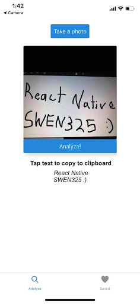

# What Text React
What Text implemented in React Native. Initially implemented in Ionic, our second project in SWEN325 was to port the app we developed in Ionic to React Native. It is functionally identical to the Ionic implementation, however, I added a copy to clipboard function to make it at least somewhat useful.

Again, due to time constraints, this is not as polished as I would have liked it to be. It was an ambitious, but fun project to work on given the length of time allocated to it. Below is an example of the app, and as you can see, I did not have time to clean up the UI before the project deadline, however, in terms of functionality, it works as intended. 

